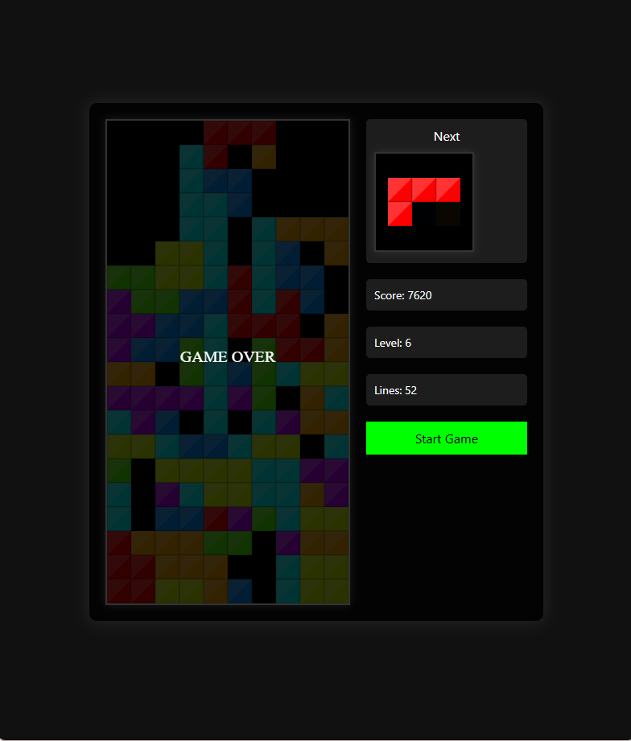

# 🎮 Tetris

A classic Tetris game built with HTML, CSS and JavaScript.

The project was created to practice JavaScript fundamentals, game logic, DOM interaction and working with the HTML Canvas API.



## ✨ Features

- Classic Tetris gameplay
- Seven different Tetris pieces
- Random piece generation
- Next piece preview
- Keyboard controls
- Piece rotation
- Collision detection
- Line clearing
- Score system
- Level system
- Increasing game speed
- Game Over screen

## 🕹️ Controls

| Key | Action |
| --- | --- |
| ⬅️ Left Arrow | Move left |
| ➡️ Right Arrow | Move right |
| ⬇️ Down Arrow | Move down |
| ⬆️ Up Arrow | Rotate piece |

## 🛠️ Technologies

- HTML5
- CSS3
- JavaScript
- HTML Canvas API

## 🚀 Run the Project

Clone the repository:

```bash
git clone YOUR-REPOSITORY-URL